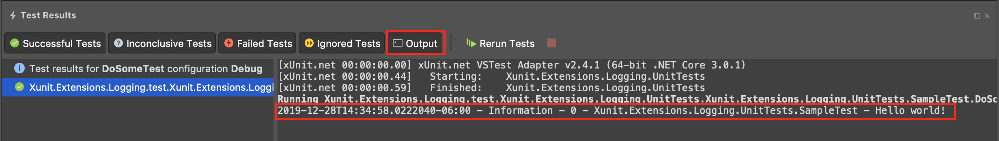

# Xunit.Extensions.Logging

## Introduction

[Xunit](https://xunit.github.io/) LoggerProvider for [Microsoft.Extensions.Logging](https://docs.microsoft.com/en-us/aspnet/core/fundamentals/logging/?view=aspnetcore-3.0) to write log events to the [Xunit test output](https://xunit.github.io/docs/capturing-output).

## Getting Started

To use the provider, first install the NuGet package:

```powershell
Install-Package Xunit.Extensions.Logging
```

Or

```bash
dotnet add package Xunit.Extensions.Logging
```

Then enable the Xunit output using `AddXunit(ITestOutputHelper)`:

```csharp
using Microsoft.Extensions.Logging;
using Xunit;
using Xunit.Abstractions;

public class SampleTest
{
    private readonly ILogger logger;

    public SampleTest(ITestOutputHelper outputHelper)
    {
        logger = LoggerFactory
                    .Create(builder =>
                    {
                        builder
                            .AddXunit(outputHelper);
                            // Add other loggers, e.g.: AddConsole, AddDebug, etc.
                    })
                    .CreateLogger<SampleTest>();
    }

    [Fact]
    public void DoSomeTest()
    {
        // Arrange
        // Act
        // Assert
        logger.LogInformation("Hello world!");
    }
}
```

Log events will be printed to the Xunit test output:


## Build and Test

Clone this repo:

```bash
git clone https://github.com/yorchideas/Xunit.Extensions.Logging.git
```

Change directory to repo root:

```bash
cd Xunit.Extensions.Logging
```

Build the solution:

```bash
dotnet restore
dotnet build
```

This will result in the following:

* Restore all NuGet packages required for building
* Build all projects. Final binaries are placed into `<repo_root>\build\bin\<Configuration>`

To run unit tests, execute:

```bash
dotnet test ./test/Xunit.Extensions.Logging.UnitTests/Xunit.Extensions.Logging.UnitTests.csproj
```

## Licences

This project is licensed under the MIT license.
